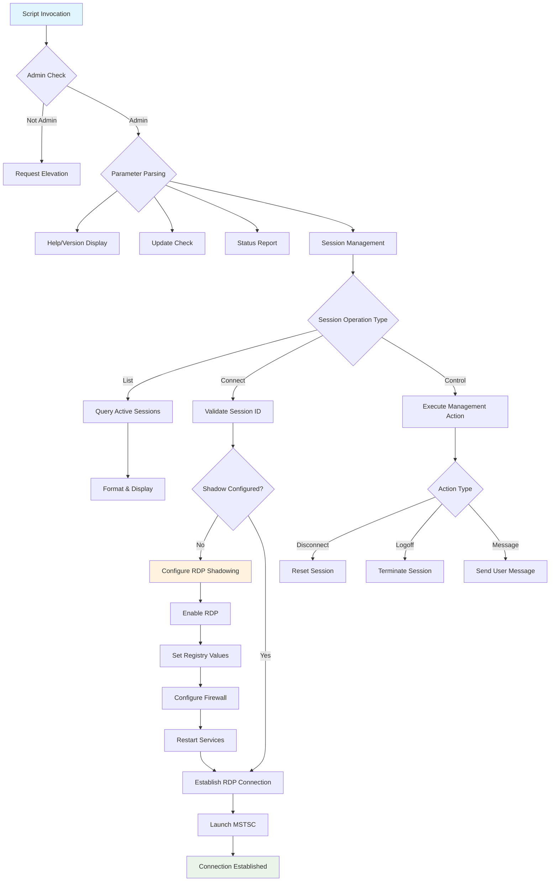
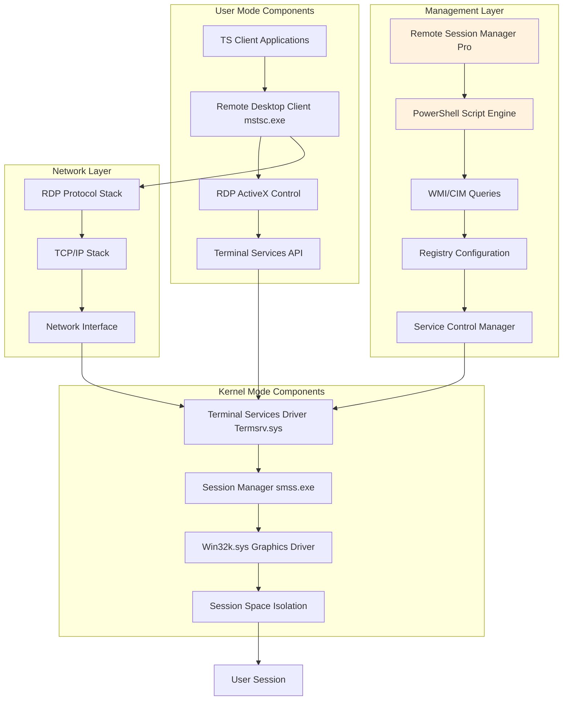
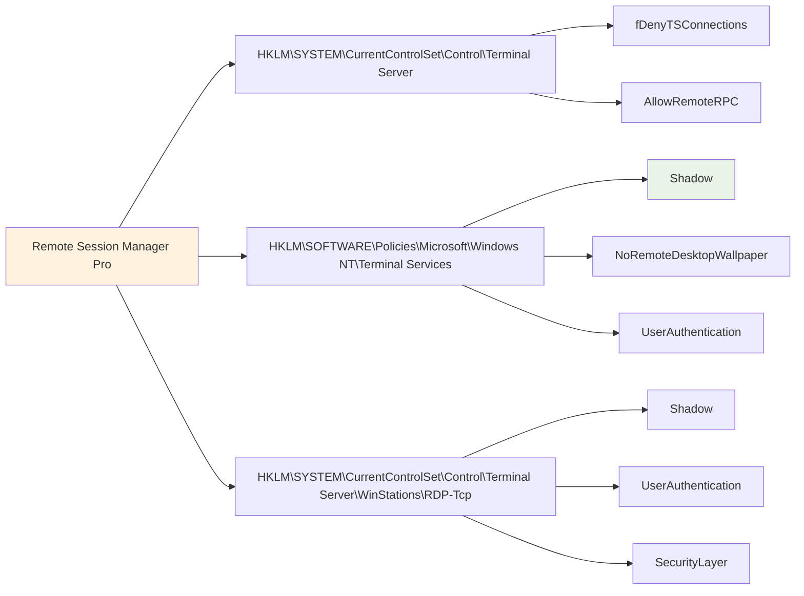
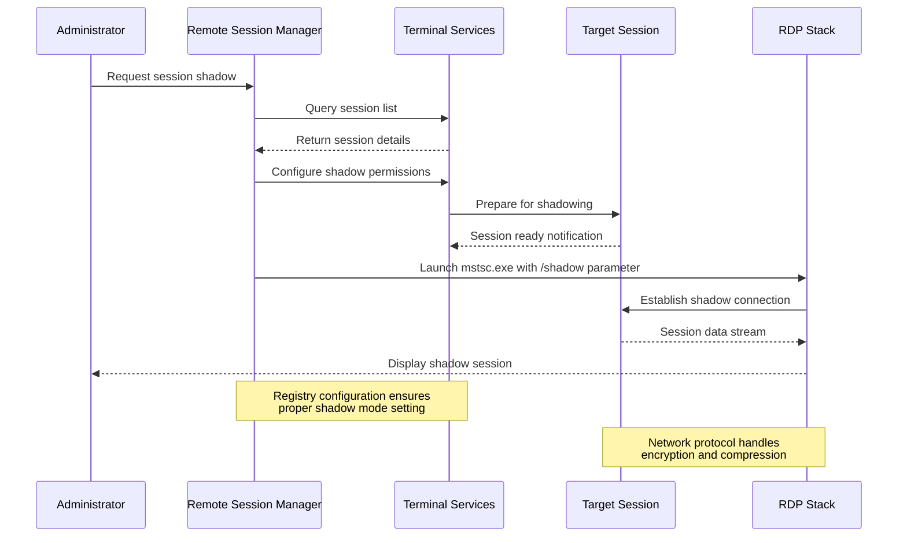

# 1st Remote Session Manager Pro

[](https://github.com/paulmann/1st-Remote-Session-Manager-Pro)
[](LICENSE)
[](https://docs.microsoft.com/en-us/powershell/)
[](https://www.microsoft.com/windows/)
[](https://docs.microsoft.com/en-us/windows-server/remote/remote-desktop-services/rds-rdsh)

## 📋 Table of Contents

- [🌟 Overview](#-overview)
- [🚀 Key Features](#-key-features)
  - [Advanced Session Management](#advanced-session-management)
  - [Comprehensive System Integration](#comprehensive-system-integration)
  - [Enterprise-Grade Administration](#enterprise-grade-administration)
- [⚙️ How It Works](#️-how-it-works)
  - [🔄 Technical Architecture](#-technical-architecture)
  - [📊 Program Flow Diagram](#-program-flow-diagram)
- [🏗️ Windows Session Management Architecture](#️-windows-session-management-architecture)
  - [Core Architecture](#core-architecture)
  - [Registry Configuration Layer](#registry-configuration-layer)
  - [Session Shadowing Implementation](#session-shadowing-implementation)
  - [Security and Authentication Flow](#security-and-authentication-flow)
- [📥 Installation & Usage](#-installation--usage)
  - [System Requirements](#system-requirements)
  - [Quick Installation](#quick-installation)
  - [Initial Configuration](#initial-configuration)
- [🔧 Parameters Reference](#-parameters-reference)
  - [Core Session Parameters](#core-session-parameters)
  - [Management & Control Parameters](#management--control-parameters)
  - [Output & Debugging Parameters](#output--debugging-parameters)
- [💻 Usage Examples](#-usage-examples)
  - [Basic Session Management](#basic-session-management)
  - [Advanced Administration](#advanced-administration)
  - [Troubleshooting & Diagnostics](#troubleshooting--diagnostics)
- [🏢 Enterprise Deployment](#-enterprise-deployment)
  - [Mass Deployment Strategies](#mass-deployment-strategies)
  - [Enterprise Security Considerations](#enterprise-security-considerations)
  - [Monitoring and Auditing](#monitoring-and-auditing)
- [🔍 Troubleshooting](#-troubleshooting)
  - [Common Issues](#common-issues)
  - [Advanced Diagnostics](#advanced-diagnostics)
  - [Performance Optimization](#performance-optimization)
- [🤝 Contributing](#-contributing)
- [📄 License](#-license)
- [🙏 Acknowledgments](#-acknowledgments)

## 🌟 Overview

**1st Remote Session Manager Pro** is an enterprise-grade PowerShell solution for advanced Remote Desktop Protocol (RDP) session management and control on Windows systems. This professional tool enables system administrators to monitor, connect to, and manage active RDP sessions with granular control over connection parameters and security settings.

Designed with years of Windows administration experience, this tool solves the complex problem of RDP session shadowing and management across diverse Windows environments (Windows 7 through Windows 11 and Server editions). It provides a unified interface for what would otherwise require multiple disparate tools and manual registry configurations.

**Core Value Proposition:**
- **Unified Session Management**: Single tool for all RDP session operations
- **Cross-Version Compatibility**: Works on Windows 7/8/8.1/10/11 and Server editions
- **Enterprise Security**: Proper handling of administrative permissions and security policies
- **Automated Configuration**: Automatic setup of required registry and service configurations

## 🚀 Key Features

### Advanced Session Management
- **Intelligent Session Discovery**: Multiple detection methods (qwinsta, query session, PowerShell cmdlets) with fallback mechanisms
- **Granular Session Control**: Connect, disconnect, logoff, or send messages to specific sessions
- **Flexible Connection Modes**: Support for view-only monitoring or full interactive control
- **Remote Computer Management**: Manage sessions on local or remote Windows systems

### Comprehensive System Integration
- **Automatic Configuration**: Detects and configures required RDP shadowing settings automatically
- **Registry Management**: Proper handling of Terminal Services registry keys across Windows versions
- **Service Control**: Intelligent management of Terminal Services and related Windows services
- **Firewall Configuration**: Automatic configuration of Windows Firewall rules for RDP access

### Enterprise-Grade Administration
- **Self-Elevation Capability**: Automatic privilege escalation when administrative rights are required
- **Execution Policy Compliance**: Verification and guidance for PowerShell execution policies
- **Self-Update Mechanism**: Automatic updates from GitHub repository with backup protection
- **Comprehensive Logging**: Detailed debug logging with configurable verbosity levels
- **Error Handling**: Robust error recovery and user-friendly error messages

## ⚙️ How It Works

### 🔄 Technical Architecture

The 1st Remote Session Manager Pro follows a modular architecture designed for reliability and maintainability:



### 📊 Program Flow Diagram

The script implements a sophisticated flow control system that ensures proper operation under various conditions:

1. **Privilege Verification Phase**
   - Checks for administrative privileges
   - Offers self-elevation when needed
   - Validates execution policy compliance

2. **Parameter Processing Phase**
   - Parses command-line arguments
   - Routes to appropriate functionality
   - Validates parameter combinations

3. **System Configuration Phase**
   - Checks current RDP/shadow configuration
   - Automatically configures missing settings
   - Restarts required services

4. **Session Operation Phase**
   - Executes the requested session operation
   - Provides appropriate feedback
   - Handles errors gracefully

## 🏗️ Windows Session Management Architecture

### Core Architecture

Windows Terminal Services (now Remote Desktop Services) employs a multi-layered architecture for session management:



### Registry Configuration Layer

The script interacts with several critical registry locations that control RDP behavior:



**Key Registry Values:**
- **fDenyTSConnections (REG_DWORD)**: `0` = RDP enabled, `1` = RDP disabled
- **Shadow (REG_DWORD)**: Controls shadowing behavior (0-4 with different permission levels)
- **UserAuthentication (REG_DWORD)**: `0` = No authentication required, `1` = Authentication required

### Session Shadowing Implementation

Session shadowing in Windows uses a sophisticated architecture that this script configures and utilizes:



### Security and Authentication Flow

The security implementation ensures proper authentication and authorization:

1. **Administrative Privilege Verification**
   - Checks Windows built-in Administrator role membership
   - Validates UAC elevation status
   - Provides clear guidance when privileges are insufficient

2. **Session Permission Validation**
   - Verifies shadowing permissions in registry
   - Checks Group Policy settings
   - Validates Windows edition capabilities

3. **Connection Security**
   - Configures appropriate authentication levels
   - Manages encryption requirements
   - Handles certificate validation where applicable

## 📥 Installation & Usage

### System Requirements

| Component | Minimum Requirement | Recommended |
|-----------|---------------------|-------------|
| **Operating System** | Windows 7 SP1 / Server 2008 R2 | Windows 10/11 / Server 2016+ |
| **PowerShell** | Version 5.1 | Version 7.2+ |
| **Memory** | 512 MB RAM | 2 GB RAM |
| **Disk Space** | 10 MB free space | 100 MB free space |
| **Permissions** | Local Administrator | Domain Administrator |
| **RDP Client** | mstsc.exe 6.1+ | mstsc.exe 10.0+ |

### Quick Installation

```powershell
# Method 1: Direct download and execution
irm https://raw.githubusercontent.com/paulmann/1st-Remote-Session-Manager-Pro/refs/heads/main/1st-Remote-Session-Manager-Pro.ps1 -OutFile RemoteSessionManager.ps1

# Method 2: Clone repository
git clone https://github.com/paulmann/1st-Remote-Session-Manager-Pro.git
cd 1st-Remote-Session-Manager-Pro

# Method 3: PowerShell Gallery (if published)
Install-Script -Name 1st-Remote-Session-Manager-Pro
```

### Initial Configuration

```powershell
# First run - configure execution policy
Set-ExecutionPolicy -ExecutionPolicy RemoteSigned -Scope CurrentUser

# Test basic functionality
.\1st-Remote-Session-Manager-Pro.ps1 -Help

# Check system status
.\1st-Remote-Session-Manager-Pro.ps1 -Status

# Update to latest version
.\1st-Remote-Session-Manager-Pro.ps1 -Update
```

## 🔧 Parameters Reference

### Core Session Parameters

| Parameter | Alias | Type | Description | Default |
|-----------|-------|------|-------------|---------|
| `-SessionId` | `-i` | Integer | Session ID to connect to or manage | `-1` |
| `-ComputerName` | `-c` | String | Target computer name | `$env:COMPUTERNAME` |
| `-ViewOnly` | `-o` | Switch | Connect in view-only mode (no control) | `$false` |
| `-Sessions` | `-e` | Switch | List all active sessions with details | `$false` |

### Management & Control Parameters

| Parameter | Alias | Type | Description |
|-----------|-------|------|-------------|
| `-Disconnect` | `-x` | Switch | Disconnect specified session (soft termination) |
| `-Logoff` | `-l` | Switch | Logoff specified session (hard termination) |
| `-Message` | `-m` | String | Send message to specified session |
| `-Force` | `-f` | Switch | Force operations without confirmation prompts |

### Output & Debugging Parameters

| Parameter | Alias | Type | Description |
|-----------|-------|------|-------------|
| `-Help` | `-h`, `-?` | Switch | Display comprehensive help information |
| `-Version` | `-v` | Switch | Display version information |
| `-Status` | `-s` | Switch | Display system configuration status |
| `-Update` | `-u` | Switch | Update script to latest version from GitHub |
| `-DebugMode` | `-d` | Switch | Enable detailed debug output |
| `-Quiet` | `-q` | Switch | Minimize console output |

## 💻 Usage Examples

### Basic Session Management

```powershell
# List all active sessions
.\1st-Remote-Session-Manager-Pro.ps1 -Sessions

# Connect to session ID 2
.\1st-Remote-Session-Manager-Pro.ps1 -SessionId 2

# Connect to session 3 in view-only mode
.\1st-Remote-Session-Manager-Pro.ps1 -SessionId 3 -ViewOnly

# Manage sessions on remote computer
.\1st-Remote-Session-Manager-Pro.ps1 -ComputerName "SERVER01" -Sessions
```

### Advanced Administration

```powershell
# Disconnect session 4 (user can reconnect)
.\1st-Remote-Session-Manager-Pro.ps1 -SessionId 4 -Disconnect

# Logoff session 5 (terminates session completely)
.\1st-Remote-Session-Manager-Pro.ps1 -SessionId 5 -Logoff

# Send message to session 6
.\1st-Remote-Session-Manager-Pro.ps1 -SessionId 6 -Message "Please save your work, maintenance in 15 minutes"

# Force logoff without confirmation
.\1st-Remote-Session-Manager-Pro.ps1 -SessionId 7 -Logoff -Force
```

### Troubleshooting & Diagnostics

```powershell
# Display comprehensive system status
.\1st-Remote-Session-Manager-Pro.ps1 -Status

# Enable debug mode for detailed logging
.\1st-Remote-Session-Manager-Pro.ps1 -Sessions -DebugMode

# Check version and update information
.\1st-Remote-Session-Manager-Pro.ps1 -Version

# Update to latest version
.\1st-Remote-Session-Manager-Pro.ps1 -Update

# Display help with examples
.\1st-Remote-Session-Manager-Pro.ps1 -Help
```

## 🏢 Enterprise Deployment

### Mass Deployment Strategies

```powershell
# Deploy via Group Policy Startup Script
# Computer Configuration → Policies → Windows Settings → Scripts → Startup

# Deploy via SCCM/MECM Application Package
# Create application package with dependency checks

# Deploy via PowerShell Remoting
$computers = @("SERVER01", "SERVER02", "SERVER03")
foreach ($computer in $computers) {
    Invoke-Command -ComputerName $computer -ScriptBlock {
        iwr -Uri "https://raw.githubusercontent.com/paulmann/1st-Remote-Session-Manager-Pro/refs/heads/main/1st-Remote-Session-Manager-Pro.ps1" -OutFile "C:\AdminTools\SessionManager.ps1"
    }
}
```

### Enterprise Security Considerations

1. **Permission Modeling**
   - Configure just enough administration (JEA) endpoints
   - Implement role-based access control (RBAC)
   - Audit all session management activities

2. **Network Security**
   - Restrict RDP access to management networks
   - Implement Network Level Authentication (NLA)
   - Use RD Gateway for external access

3. **Compliance Requirements**
   - Maintain session connection logs
   - Implement dual-control for sensitive operations
   - Regular audit of shadowing permissions

### Monitoring and Auditing

```powershell
# Sample monitoring script for enterprise deployment
$logPath = "C:\Logs\SessionManagement"
$timestamp = Get-Date -Format "yyyyMMdd-HHmmss"

# Log all session management activities
Start-Transcript -Path "$logPath\SessionMgmt-$timestamp.log"

# Regular status checks
.\1st-Remote-Session-Manager-Pro.ps1 -Status -ComputerName "SERVER01" | Out-File "$logPath\Status-SERVER01-$timestamp.txt"

# Session activity reporting
.\1st-Remote-Session-Manager-Pro.ps1 -Sessions -ComputerName "SERVER01" | Export-Csv "$logPath\Sessions-SERVER01-$timestamp.csv"

Stop-Transcript
```

## 🔍 Troubleshooting

### Common Issues

| Issue | Symptoms | Solution |
|-------|----------|----------|
| **Access Denied** | "Administrative privileges are required" | Run PowerShell as Administrator or allow script self-elevation |
| **Execution Policy** | "Script execution is disabled" | Run `Set-ExecutionPolicy RemoteSigned -Scope CurrentUser` |
| **Session Not Found** | "Session ID X not found" | Verify session ID with `-Sessions` parameter |
| **Shadow Disabled** | "RDP shadowing is not properly configured" | Allow script to auto-configure or manually set registry values |
| **Firewall Blocked** | Connection timeout or refusal | Ensure Windows Firewall allows RDP (port 3389) |

### Advanced Diagnostics

```powershell
# Enable comprehensive debugging
$DebugPreference = "Continue"
$VerbosePreference = "Continue"

# Run with maximum diagnostic output
.\1st-Remote-Session-Manager-Pro.ps1 -Status -DebugMode

# Check specific Windows components
Get-Service -Name TermService, SessionEnv, UmRdpService
Get-NetFirewallRule -DisplayGroup "Remote Desktop" | Where-Object {$_.Enabled -eq $true}
Get-ItemProperty -Path "HKLM:\SOFTWARE\Policies\Microsoft\Windows NT\Terminal Services" -Name "Shadow" -ErrorAction SilentlyContinue
```

### Performance Optimization

1. **Registry Optimization**
   ```powershell
   # Optimize RDP performance settings
   Set-ItemProperty -Path "HKLM:\SOFTWARE\Policies\Microsoft\Windows NT\Terminal Services" -Name "NoRemoteDesktopWallpaper" -Value 1
   Set-ItemProperty -Path "HKLM:\SOFTWARE\Policies\Microsoft\Windows NT\Terminal Services" -Name "DisableBackgroundWallpaper" -Value 1
   ```

2. **Network Optimization**
   - Configure RDP compression settings
   - Adjust display quality based on network bandwidth
   - Implement Quality of Service (QoS) for RDP traffic

## 🤝 Contributing

We welcome contributions from the community! Here's how you can help:

1. **Report Issues**
   - Use GitHub Issues to report bugs or request features
   - Include detailed reproduction steps and system information

2. **Submit Improvements**
   - Fork the repository
   - Create a feature branch
   - Submit a pull request with clear description

3. **Areas Needing Contribution**
   - Additional session management features
   - Enhanced remote management capabilities
   - Integration with other management platforms
   - Extended logging and reporting features

## 📄 License

This project is licensed under the MIT License - see the [LICENSE](LICENSE) file for details.

**Commercial Use**: This software may be used commercially without restriction. Attribution is appreciated but not required.

**Disclaimer**: This tool interacts with critical Windows system components. Use at your own risk and always test in non-production environments first.

## 🙏 Acknowledgments

- **Microsoft** for the Windows Terminal Services/Remote Desktop Services platform
- **PowerShell Team** for creating such a powerful automation platform
- **Open Source Community** for inspiration and collaboration opportunities
- **All Contributors** who help improve this tool for everyone

---

**Maintainer**: Mikhail Deynekin  
**Contact**: mid1977@gmail.com  
**Website**: https://deynekin.com  
**Repository**: https://github.com/paulmann/1st-Remote-Session-Manager-Pro  

*Last Updated: January 2025*  
*Windows and Remote Desktop are trademarks of Microsoft Corporation*
